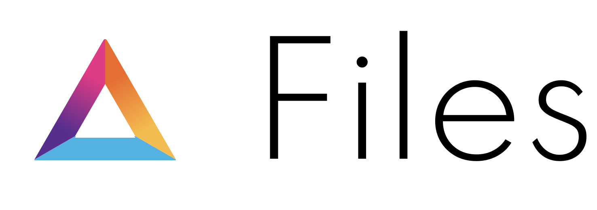

Files is a web3 file storage application built on the Internet Computer. The end goal is to provide users with a beautiful interface that compliments their native OS and provides easy functionality for storing and retrieving their personal data. It stands as an open-source competitor to the likes of google drive, dropox, box, etc. Files stores it's data on the [Internet Computer](https://dfinity.org/technicals/overview-of-the-internet-computer) which means the data is replicated across multiple data-centers in multiple locations. As the project progresses the goal is to turn governance over to the users. Later improvements will include file sharing, and integration with third-party dapps.

This project is still in very early development.

Also note, this project is not currently hosted on the internet computer, but will be once they open it up for deployment.

## Architecture

This project was bootstrapped from [sudograph](https://github.com/sudograph/sudograph). It has a rust backend and typescript front-end. The front-end eschews popular frameworks in favor of native web components. It uses [lit-html](https://lit-html.polymer-project.org/guide/getting-started) to help with templating, but sticks to web standards as closely as possible.

Disclaimer: the project may switch to another framework if the pros outweight the cons.

## Local Development

1. In one terminal `dfx start`
2. In another terminal `dfx deploy`
